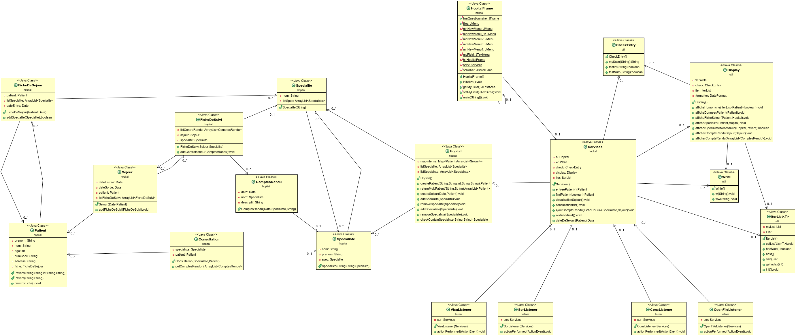

Elsa Da Silva & Lukas Ramus  
M1 Miage  
16 octobre 2018  V1.0  

TP HOPITAL
==========

Sommaire :
----------

[I° - Introduction au TP](#i-Introduction-au-TP-)  
[II° - UML](#ii-uml-)  
[III° - Compilation du projet](#v-compilation-du-projet-)  

 I° - Introduction au TP :  
 --------------------------

Ce tp simule un hopital. Une interface utilisateur graphique s ouvre lors de l execution du projet.
Cette interface se compose de cinq menus :
	- Patient :
Ce menu permet de proceder a l entree d un patient. Les informations nom et prenom sont demandees. S il
n existe pas dans la base de l hopital, des informations complementaires sont demandees ainsi que les
specialites qui lui sont rattachees. Si le patient existe, il est possible de lui rajouter des specialites dans sa fiche de sejour. Le cas des homonymes est gere.
NB : Un numero de securite social valide est demande (15 chiffres). Ex : 190115950256348

   - Visualisation :
Ce menu permet de visualiser la fiche de sejour d un patient.

   - Consulation :
Ce menu permet d effectuer une consultation pour une des specialite presente dans la fiche de sejour par un des specialistes rattache a la specialite.

   - Sortie :
Ce menu permet d effectuer la sortie de l hopital du patient. Sa fiche de sejour est alors detruite.

   - Quitter l application : 
Ce menu permet de quitter l'application.

II° - UML :   
-------------------

Uml of the project :  
  

III° - Compilation du projet :
------------------------------

### Compiler :

Pour compiler le projet, il suffit de faire la commande suivante :

	$ mvn package  

--------------------------------------------------------

### Execution :

Pour executer le projet, executez la commande suivante :  

	$ java -jar target/COO-TP3-1.0-SNAPSHOT.jar  

[Retour haut de page](#top)  
